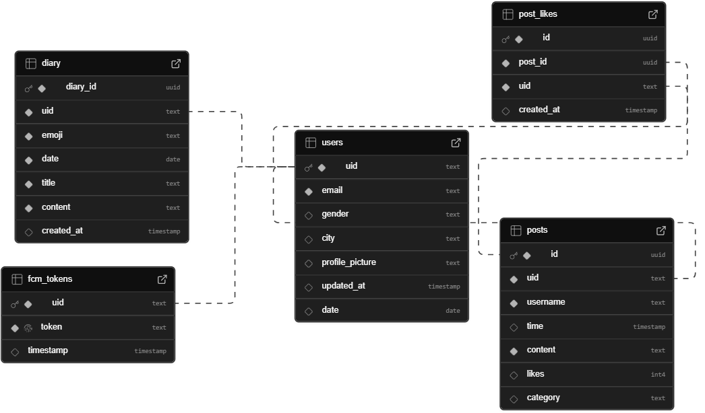
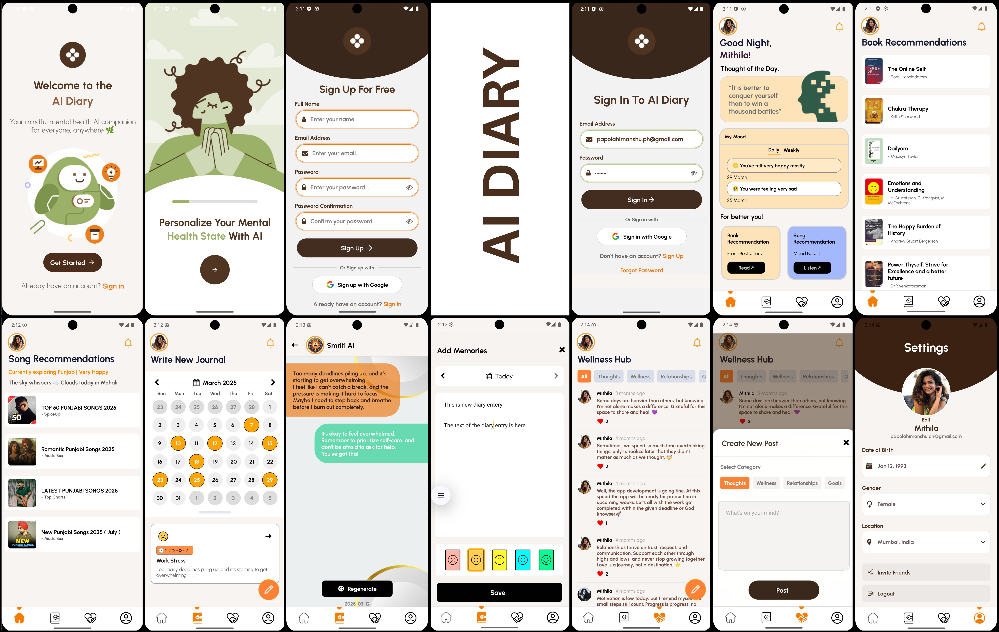

# 📕 AI Diary (Android App)

is a React Native mobile application built to help users securely write, manage, and reflect on their daily experiences. It features AI-generated reflections, and seamless Supabase integration for user data management.

## 🧱 Tech Stack

| Layer    | Technology           |
| -------- | -------------------- |
| Frontend | React Native (Metro) |
| Backend  | Supabase             |
| Deploy   | Apk stores           |

## 📸 App Showcase




## 🚀 Getting Started

### 🔧 Prerequisites

- Git
- Node.js 18+
- Android/iOS simulator

## 📦 Installation & Setup

### 1. Run these commands

```bash
git clone https://github.com/your-username/AiDiary.git
cd AiDiary
npm i
npx react-native run-android
```

## ✨ Features

📝 Create, edit, and delete diary entries

📅 Calendar-based entry filtering

🫂 Community section

🔔 Notification system from firebase

## 🔮 Future Scope

- 📊 Better storage solution
- 🧠 Implement Encryption
